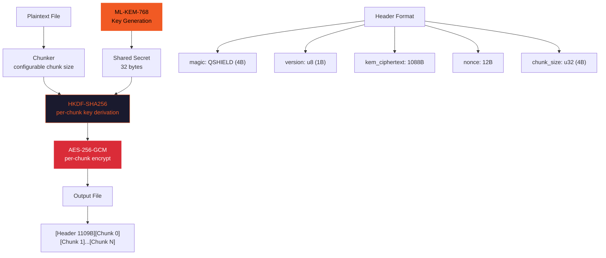
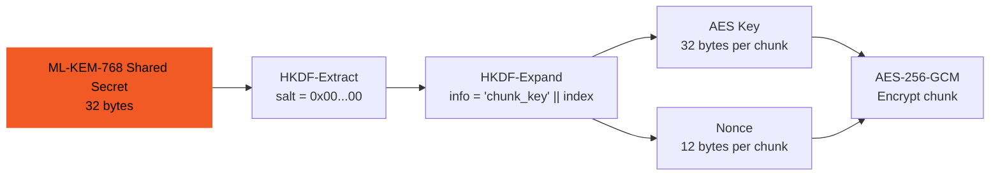
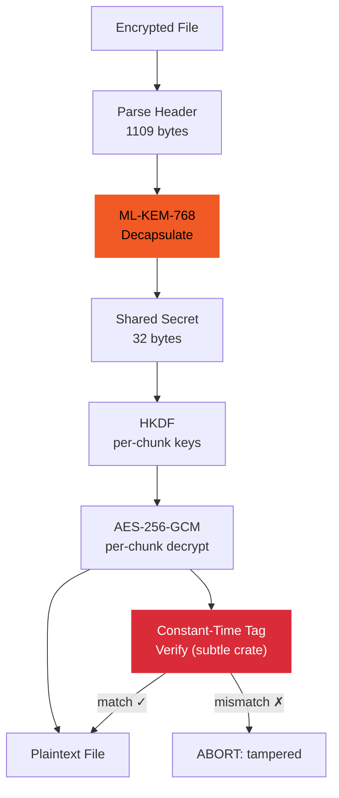

## Architecture

quantum-shield is a **post-quantum file encryption CLI** using NIST FIPS 203 (ML-KEM-768) key encapsulation + AES-256-GCM authenticated encryption. Chunked files, constant-time comparisons, single binary.

### Encryption Pipeline



### Key Derivation Chain



### Decryption Pipeline



## Quickstart

### One-liner — Encrypt a file

```bash
cargo install quantum-shield && echo "secret data" > secret.txt && quantum-shield encrypt secret.txt -o secret.txt.enc
```

### One-liner — Decrypt a file

```bash
quantum-shield decrypt secret.txt.enc -o secret.txt
```

### One-liner — Build from source + test

```bash
git clone https://github.com/BartoszOsiej/quantum-shield && cd quantum-shield && cargo build --release && cargo test
```

### One-liner — Benchmark crypto operations

```bash
git clone https://github.com/BartoszOsiej/quantum-shield && cd quantum-shield && cargo run --release -- --bench
```

### One-liner — Encrypt with custom chunk size

```bash
quantum-shield encrypt large-file.bin -o large-file.bin.enc --chunk-size 65536
```

### One-liner — Docker

```bash
docker run --rm -v "$(pwd)":/data -w /data \
  ghcr.io/bartoszosiej/quantum-shield:latest \
  quantum-shield encrypt secret.txt -o secret.txt.enc
```

### Verify

```bash
quantum-shield info secret.txt.enc     # show header metadata
quantum-shield verify secret.txt.enc   # verify integrity (decrypt + tag check)
quantum-shield --version               # show ML-KEM-768 + AES-256-GCM versions
```
